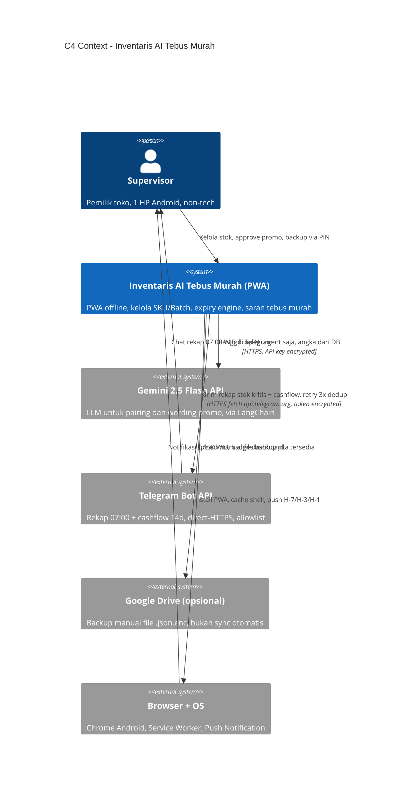
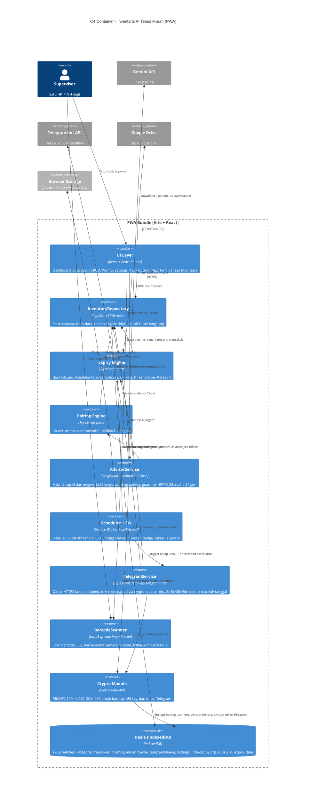

# Architecture — Inventaris AI Tebus Murah

> Arsitektur scalable pragmatis untuk UMKM 1 toko sekarang, siap untuk 10 toko nanti. Local-first, no backend v1, sync-ready tanpa gold-plating.

- **Versi:** 1.0
- **Tanggal:** 2026-08-31
- **Status:** Accepted
- **Prinsip:** Local-first, offline 100 persen operasional harian, angka dari DB bukan dari LLM
- **Stack v1:** Vite + React + TypeScript + Dexie (IndexedDB) + vite-plugin-pwa + LangChain + Gemini 2.5 Flash (API, online on-demand) + Telegram Bot API (direct-HTTPS fetch, allowlist) + html5-qrcode (lazy di /scan, allowlist)
- **Rujukan:** [CONTEXT.md](../CONTEXT.md), [ADR-001](./adr/0001-local-first-dexie-backup-drive.md), [ADR-002](./adr/0002-langchain-gemini-hybrid-advisor.md), [FRD](../docs/frd.md)

---

## Daftar Isi

1. [Prinsip Arsitektur](#prinsip-arsitektur)
2. [C4 Context Diagram](#c4-context-diagram)
3. [C4 Container Diagram](#c4-container-diagram)
4. [Data Model dan org_id Sharding](#data-model-dan-org_id-sharding)
5. [Local-First Dexie dan Repository Pattern](#local-first-dexie-dan-repository-pattern)
6. [Sync-Ready Design Tanpa Sync v1](#sync-ready-design-tanpa-sync-v1)
7. [Scalability 1 ke 10 Toko](#scalability-1-ke-10-toko)
8. [Migration Path ke Supabase](#migration-path-ke-supabase)
9. [Tradeoff Table Dexie vs OPFS vs Supabase](#tradeoff-table-dexie-vs-opfs-vs-supabase)
10. [Security PIN PBKDF2 AES-GCM](#security-pin-pbkdf2-aes-gcm)
11. [Performance IndexedDB Pagination dan Caching](#performance-indexeddb-pagination-dan-caching)
12. [Failure Modes dan Mitigasi](#failure-modes-dan-mitigasi)
13. [Keputusan dan Trace ADR](#keputusan-dan-trace-adr)
14. [Apa yang Tidak Dibangun v1](#apa-yang-tidak-dibangun-v1)

---

## Prinsip Arsitektur

1. **Local-first, offline adalah default.** Semua baca tulis lewat IndexedDB. Internet hanya untuk refresh saran AI dan backup opsional. Sesuai ADR-001.
2. **Satu HP, satu Supervisor.** Tidak ada multi-user v1. Semua data punya `org_id = toko-01` sejak hari pertama, jadi sharding sudah siap walau belum dipakai.
3. **Repository sebagai seam.** UI dan engine tidak pernah import Dexie langsung. Semua lewat `InventoryRepository`. Ini satu-satunya pintu kalau nanti ganti ke Supabase.
4. **Hybrid advisor, bukan LLM do everything.** Rule hitung `daysToExpiry` dan `urgencyScore`, LLM hanya pairing dan wording. Guardrail `harga_tebus >= HPP*0.85` jalan di code, bukan di prompt.
5. **Pragmatis, bukan gold-plating.** Tidak ada multi-DC sync, tidak ada event sourcing, tidak ada microservice. Yang ada cuma yang dipakai UMKM hari ini plus path yang jelas untuk naik ke 10 toko.

---

## C4 Context Diagram

Diagram level 1, lihat sistem dari luar. Siapa pakai, apa di luar sistem, dan batasnya di mana.



**Batas konteks yang penting:**

- Di dalam sistem: semua logic inventaris, expiry engine, pairing rule, cache advisor, enkripsi backup, antre Telegram, scan barcode.
- Di luar sistem: Gemini API (online, on-demand), Telegram Bot API (direct-HTTPS, allowlist), Google Drive (manual), browser sebagai runtime.
- Tidak ada backend sendiri v1. Tidak ada server yang harus di-maintain. Telegram adalah outbound fetch langsung dari browser, bukan backend.

---

## C4 Container Diagram

Diagram level 2, pecah PWA jadi container yang bisa di-deploy sebagai satu bundle.



**Alur baca tulis yang di-endorse:**

```
UI -> InventoryRepository -> Dexie
Engine -> InventoryRepository -> Dexie
AdvisorService -> Pairing + Engine -> InventoryRepository -> Dexie + (Gemini jika online)
Scheduler -> Engine -> InventoryRepository -> Dexie -> Notification API + TelegramService
TelegramService -> Crypto (decrypt token) -> fetch api.telegram.org -> Telegram, antre telegramQueue jika offline retry 3x 5s/30s/5m dedup batchId+tanggal
BarcodeScanner -> html5-qrcode lazy di /scan -> isi barcode SKU, fallback manual jika permission denied
Crypto -> PBKDF2(PIN) -> AES-GCM -> file .json.enc + token Telegram + API key Gemini
```

Tidak ada jalur yang bypass Repository. Kalau ada code yang import Dexie langsung di komponen React, itu bug arsitektur.

---

## Data Model dan org_id Sharding

### Tabel Dexie v1

| Tabel | Key | Index penting | Catatan |
|-------|-----|---------------|---------|
| `skus` | `id` | `org_id`, `kategori_id`, `nama` | Tidak punya `expiry_date`. Anti-pattern CONTEXT. |
| `batches` | `id` | `org_id`, `sku_id`, `expiry_date`, `received_at` | `expiry_date` nullable, `hpp_snapshot` copy dari SKU |
| `kategoris` | `id` | `org_id`, `nama` | `threshold_h_minus: [7,3,1]` editable |
| `transaksis` | `id` | `org_id`, `sku_id`, `sold_at` | Sumber avgDailyUsage dan co-occurrence |
| `promos` | `id` | `org_id`, `batch_id`, `status` | `proposed -> active -> expired/consumed` |
| `advisorCache` | `id` | `org_id`, `batch_id`, `created_at` | TTL 24 jam, key `batch_id + created_at` |
| `telegramQueue` | `id` | `org_id`, `dedupKey`, `created_at` | Antre Telegram offline, dedup `batchId+tanggal`, retry 3x 5s/30s/5m |
| `settings` | `key` | `org_id` | Simpan threshold, lastBackupAt, PIN hash, token Telegram terenkripsi |

Semua tabel punya `org_id` dengan default `toko-01`. Ini bukan premature optimization. Ini satu kolom yang bikin migration ke multi-toko tidak perlu rewrite.

### Kenapa org_id sejak v1

- Query selalu `where({ org_id }).filter(...)` jadi siap shard.
- Backup file header simpan `org_id`, restore bisa validasi silang.
- Kalau nanti butuh `toko-02`, tidak ada migrasi skema, cuma tambah data dengan `org_id` baru dan filter di Repository.
- Comment di code: `// sync-ready: org_id sharding, v1 single org toko-01`.

### Index yang wajib ada

```ts
// Contoh Dexie schema v1 (ringkas)
db.version(1).stores({
  skus: 'id, org_id, kategori_id, nama',
  batches: 'id, org_id, sku_id, expiry_date, received_at',
  kategoris: 'id, org_id, nama',
  transaksis: 'id, org_id, sku_id, sold_at',
  promos: 'id, org_id, batch_id, status',
  advisorCache: 'id, org_id, batch_id, created_at',
  telegramQueue: 'id, org_id, dedupKey, created_at',
  settings: 'key, org_id',
});
```

Index `expiry_date` penting untuk query engine: `batches.where('expiry_date').above(0)` tanpa scan semua.

---

## Local-First Dexie dan Repository Pattern

### Kenapa Repository, bukan Dexie langsung

ADR-001 bilang reversible via Repository. Praktiknya:

```ts
// src/db/repository.ts
export interface InventoryRepository {
  // SKU
  listSkus(orgId: string): Promise<SKU[]>;
  getSku(id: string): Promise<SKU | undefined>;
  createSku(sku: SKU): Promise<void>;
  // Batch
  listBatchesBySku(skuId: string, orgId: string): Promise<Batch[]>;
  listBatchesExpiring(orgId: string): Promise<Batch[]>; // expiry_date != null
  createBatch(batch: Batch): Promise<void>;
  // Kategori, transaksi, promo, cache, settings ...
}

// v1: DexieInventoryRepository implements InventoryRepository
// v2: SupabaseInventoryRepository implements InventoryRepository (tambah sync)
// UI dan engine hanya kenal interface, tidak kenal Dexie atau Supabase.
```

### Aturan main

- UI, engine, advisor, scheduler import `InventoryRepository`, bukan `db` Dexie.
- Dexie hanya dipakai di `DexieInventoryRepository` dan di `db.ts` untuk definisi schema.
- `liveQuery` dari Dexie di-bungkus jadi observable di Repository, jadi UI tetap reaktif tanpa tau IndexedDB.
- Validasi domain (HPP > 0, harga_tebus >= HPP*0.85, threshold tidak duplikat) jalan di Repository sebelum tulis, bukan di komponen.

### Keuntungan pragmatis

- Ganti DB tidak ubah UI. Test bisa pakai `FakeInventoryRepository` in-memory tanpa IndexedDB.
- Sync-ready tanpa cost sync sekarang. Tidak ada WebSocket, tidak ada conflict resolver yang belum dipakai.
- Code review bisa cek satu hal: ada import `dexie` di luar `src/db/`? Kalau ya, tolak.

---

## Sync-Ready Design Tanpa Sync v1

Sync tidak ada di v1, tapi desain tidak bikin sync jadi rewrite. Bedanya tipis tapi penting.

### Yang sudah ready

- `org_id` di semua tabel dan semua query.
- `updated_at` dan `deleted_at` (soft delete) di skus, batches, promos. Ditambah di Dexie v1 walau belum dipakai sync, biar tidak butuh migrasi breaking nanti.
- `version` per row (increment tiap update) untuk last-write-wins sederhana.
- Repository interface sudah pakai `orgId` di semua method, jadi nanti `SupabaseInventoryRepository` bisa filter by RLS `org_id`.
- Komentar `// sync-ready` di schema dan Repository sebagai marker.

### Yang sengaja tidak ada v1

- Tidak ada sync engine, tidak ada realtime subscription, tidak ada conflict UI.
- Tidak ada backend, tidak ada tabel `sync_queue`, tidak ada retry.
- Tidak ada multi-HP. Supervisor tetap satu HP, sesuai FRD.

### Kapan sync dibutuhkan

Saat UMKM buka toko ke-2 atau mau akses dari HP kedua. Sampai itu terjadi, local-first lebih murah, lebih cepat, dan tidak butuh kuota.

---

## Scalability 1 ke 10 Toko

Target bukan 1000 toko. Target 1 toko sekarang, 10 toko dalam 1 sampai 2 tahun, tanpa rewrite.

### Fase 1: 1 toko (v1 sekarang)

- Satu `org_id = toko-01`, satu Dexie, satu HP.
- Semua query filter `org_id` walau cuma satu nilai.
- Backup manual `.json.enc` ke Drive. Cukup.

### Fase 2: 2 sampai 3 toko (butuh lihat stok toko lain, belum realtime)

- Tetap Dexie per device, tapi tambah `org_id` kedua dan ketiga di device supervisor pusat.
- Supervisor pusat bisa switch toko di UI (dropdown org), Repository query ganti `orgId`.
- Backup per org_id, file terpisah atau satu file dengan header multi-org.
- Tidak butuh Supabase kalau masih manual. Tradeoff: tidak realtime, tapi zero cost tetap.

### Fase 3: 3 sampai 10 toko (butuh sync dan akses multi-HP)

- Migrasi ke Supabase (lihat migration path di bawah).
- Tiap toko punya `org_id` sendiri, RLS di Supabase filter by `org_id`.
- Dexie tetap jadi cache lokal, Supabase jadi source of truth.
- Sync: pull on app start, push on write dengan `updated_at` last-write-wins. Tidak ada OT atau CRDT, karena inventaris bukan Google Docs.

### Sharding by org_id

- Shard key: `org_id`. Semua query, semua RLS, semua backup pakai ini.
- Tidak ada shard by geography atau by SKU. Satu toko satu shard, paling sederhana.
- Estimasi data: 1 toko ~ 500 SKU, 2000 Batch per tahun, 5000 transaksi per tahun. 10 toko ~ 10x itu, masih kecil untuk Postgres.

### Yang tidak di-scale

- Tidak ada sharding Batch per bulan. Tidak perlu.
- Tidak ada read replica. Supabase single primary cukup untuk 10 toko.
- Tidak ada CDN untuk data inventaris, hanya untuk PWA shell yang sudah di-cache SW.

---

## Migration Path ke Supabase

Path ini tidak jalan v1, tapi sudah di-desain biar tidak tebak-tebakan saat butuh. Tiap langkah bisa jalan tanpa downtime toko.

### Langkah 0: Siapkan tanpa ganggu v1

- Pastikan Dexie sudah punya `org_id`, `updated_at`, `version`, `deleted_at` di semua tabel. Ini sudah di v1.
- Pastikan semua akses lewat `InventoryRepository`. Audit import Dexie.

### Langkah 1: Buat project Supabase dan schema mirror

```sql
-- Supabase Postgres, RLS on
create table skus (id text primary key, org_id text not null, kategori_id text, nama text, hpp numeric, harga_normal numeric, updated_at timestamptz, version int, deleted_at timestamptz);
create table batches (id text primary key, org_id text not null, sku_id text, qty int, expiry_date date, received_at timestamptz, hpp_snapshot numeric, updated_at timestamptz, version int, deleted_at timestamptz);
-- ... kategoris, transaksis, promos, advisor_cache, settings serupa
alter table skus enable row level security;
create policy "org isolation" on skus for all using (org_id = current_setting('app.org_id', true));
-- Ulangi untuk semua tabel
```

### Langkah 2: Implement SupabaseInventoryRepository

- Buat `SupabaseInventoryRepository implements InventoryRepository`.
- Method baca: coba Dexie dulu (cache), fallback Supabase jika miss, lalu tulis ke Dexie.
- Method tulis: tulis ke Supabase dulu, jika sukses tulis ke Dexie, jika offline tulis ke Dexie dan masukkan ke `outbox` untuk push nanti.
- Tambah `outbox` table di Dexie untuk sync queue sederhana (id, table, op, payload, created_at).

### Langkah 3: Dual-write dan backfill

- Tool one-off: export Dexie v1 ke JSON, import ke Supabase via script dengan `org_id = toko-01`.
- Verifikasi row count sama.
- Ganti DI di app: `getRepository()` return Supabase impl jika `VITE_SYNC_ENABLED=true`, else Dexie impl.

### Langkah 4: Aktifkan RLS dan auth

- Supabase Auth email atau magic link untuk supervisor per org.
- Set `app.org_id` dari JWT claim.
- PIN lokal tetap untuk buka HP, Auth Supabase untuk sync cloud. Dua layer, tidak saling ganti.

### Langkah 5: Nyalakan sync incremental

- On app start: `select * where org_id = ? and updated_at > lastSyncAt`.
- On write: push langsung, jika gagal masuk outbox, retry saat online (listen `navigator.onLine`).
- Conflict: last-write-wins by `updated_at` dan `version`. Tidak ada merge field level v1, cukup tampil toast "Data diperbarui dari device lain".

### Estimasi effort

- Langkah 0 sudah selesai di v1.
- Langkah 1 sampai 5 sekitar 2 sampai 3 minggu untuk 1 dev, tanpa ubah UI. Itu kenapa Repository pattern worth it.

---

## Tradeoff Table Dexie vs OPFS vs Supabase

Pilihan storage untuk inventaris UMKM. Tabel ini yang dipakai ADR-001 untuk putuskan Dexie.

| Aspek | Dexie (IndexedDB) | OPFS + SQLite (wa-sqlite) | Supabase (Postgres cloud) |
|-------|-------------------|---------------------------|---------------------------|
| **Offline** | 100 persen offline, zero config | 100 persen offline, tapi butuh WASM + OPFS | Butuh internet, offline cuma cache |
| **Setup complexity** | Rendah, `new Dexie()`, schema string | Sedang ke tinggi, WASM, worker, VFS | Sedang, project, RLS, auth, env |
| **Query power** | Cukup untuk inventaris, index + filter, no JOIN | Kuat, SQL penuh, JOIN, transaction | Paling kuat, SQL penuh + realtime |
| **Cost v1** | Gratis, 0 rupiah | Gratis, tapi bundle lebih besar | Gratis tier ada, tapi butuh kartu dan monitoring |
| **Bundle size** | Kecil, Dexie ~ 30kb gz | Besar, WASM SQLite ~ 300kb+ | Kecil di client, cost di server |
| **Multi-toko sync** | Tidak ada, harus build sendiri | Tidak ada, harus build sendiri | Ada, realtime + RLS per org_id |
| **Backup** | Export JSON manual, mudah | Export SQLite file, agak ribet | Dump Postgres, tapi butuh akses cloud |
| **Kecocokan UMKM 1 toko** | Pas, simple, cepat, tidak butuh backend | Overkill, power tidak kepakai | Overkill v1, butuh internet dan auth |
| **Migration path** | Mudah ke Supabase via Repository | Agak susah, SQLite ke Postgres tidak 1 banding 1 | Tidak perlu migrasi, tapi lock-in cloud |
| **Risiko** | Data hilang kalau HP rusak dan tidak backup | Sama, plus risiko WASM tidak jalan di HP kentang | Vendor lock, butuh internet, cost naik saat scale |
| **Keputusan v1** | **Dipilih** | Ditolak, kompleks tanpa manfaat | Ditolak v1, disiapkan untuk v2 |

**Cost ringkas:**

- Dexie: 0 cost + 0 backend + 1 hari setup.
- OPFS: 0 cost + 3 hari setup + bundle berat + HP lama bisa lambat.
- Supabase: 0 sampai 25 dolar per bulan saat scale + 1 minggu setup RLS dan auth + butuh internet stabil di toko.

Untuk UMKM 1 toko yang sering sinyal lemah, Dexie menang telak. Supabase menang saat sudah 3 toko ke atas dan butuh lihat stok dari HP kedua.

---

## Security PIN PBKDF2 AES-GCM

Keamanan untuk UMKM bukan soal enterprise SSO. Soalnya HP hilang, file backup bocor, dan API key jangan plaintext.

### PIN: hash, bukan simpan asli

- PIN 4 digit tidak disimpan plaintext di Dexie atau localStorage.
- Simpan `pinHash = PBKDF2(PIN, saltPin, 100k, 32 byte)` dan `saltPin` 16 byte random.
- Verifikasi: hash input PIN dengan salt yang sama, bandingkan dengan hash simpan. Tidak ada decrypt PIN.
- PIN dipakai juga sebagai input key untuk enkripsi, tapi tidak disimpan sebagai key.

### Key derivation: PBKDF2 100k iterasi

```ts
async function deriveKey(pin: string, salt: Uint8Array): Promise<CryptoKey> {
  const enc = new TextEncoder();
  const baseKey = await crypto.subtle.importKey('raw', enc.encode(pin), 'PBKDF2', false, ['deriveKey']);
  return crypto.subtle.deriveKey(
    { name: 'PBKDF2', salt, iterations: 100_000, hash: 'SHA-256' },
    baseKey,
    { name: 'AES-GCM', length: 256 },
    false, // tidak extractable, tidak bisa di-export
    ['encrypt', 'decrypt']
  );
}
```

- Iterasi 100k sesuai FRD-06 dan OWASP. Tidak 10k, tidak 1 juta yang bikin HP kentang hang.
- Salt 16 byte random tiap backup file, simpan di header file, bukan hardcode.
- Key tidak pernah disimpan, hanya di-derive saat butuh, lalu hilang dari memory.

### Enkripsi: AES-GCM-256

- Backup JSON di-encrypt pakai AES-GCM-256 dengan IV 12 byte random per file.
- Header file: `{ version: 1, org_id: "toko-01", salt: base64, iv: base64, created_at: ISO }` lalu `ciphertext` base64.
- API key Gemini juga di-encrypt dengan key turunan PIN yang sama, simpan ciphertext di localStorage, bukan Dexie agar tidak ikut ter-export plain.
- Tidak ada plaintext key di code, tidak ada `localStorage.setItem('apiKey', plain)`.

### Yang tidak dilakukan

- Tidak ada biometrik v1, PIN cukup untuk UMKM.
- Tidak ada 2FA cloud v1, karena tidak ada cloud.
- Tidak ada enkripsi per-field di Dexie v1, cukup backup file dan API key yang di-encrypt. Enkripsi Dexie penuh bikin query lambat tanpa manfaat besar untuk single device.

---

## Performance IndexedDB Pagination dan Caching

IndexedDB bukan Postgres. Harus paham limitnya biar tidak lemot di HP 2GB RAM.

### Limit IndexedDB yang relevan

- Quota: tiap origin bisa 60 persen dari disk kosong, tapi browser bisa evict kalau device penuh. Chrome Android biasanya 50MB sampai ratusan MB tergantung sisa storage. Untuk 500 SKU + 2000 Batch, data JSON sekitar 2 sampai 5 MB, aman.
- Tidak ada JOIN, tidak ada agregasi server. Semua filter dan sort jalan di JS.
- Baca tulis IndexedDB async tapi main thread tetap bisa block kalau query scan semua tanpa index.

### Indexing yang dipakai

- Index `org_id` di semua tabel untuk sharding.
- Index `sku_id` di batches dan transaksis untuk list per SKU.
- Index `expiry_date` di batches untuk engine: `where('expiry_date').above(0)` tanpa scan null.
- Index `created_at` di advisorCache untuk ambil 5 terbaru.

### Pagination

- Dashboard urgent list: ambil top 20 urgent saja, bukan semua batch. Engine hitung score untuk semua yang punya expiry, tapi UI hanya render 20.
- List SKU: pagination 50 per halaman atau virtual scroll kalau sudah 500. Jangan render 500 card sekaligus.
- Histori transaksi: query 14 hari terakhir untuk avgDailyUsage, bukan semua histori. `transaksis.where('sold_at').above(last14Days)`.

### Caching advice

- AdvisorCache TTL 24 jam, jadi tidak panggil Gemini tiap buka dashboard. Hit rate target 70 persen.
- `liveQuery` Dexie untuk dashboard, jadi badge update reaktif tanpa polling.
- Jangan cache hasil `daysToExpiry` di Dexie, hitung on the fly karena `today` ganti tiap hari. Cache ranking boleh tapi invalidate tiap hari 00:00 WIB.

### Angka kasar

- 2000 Batch di-hitung urgency: < 50ms di HP mid-range.
- Render 20 urgent card: < 100ms.
- Export backup 500 SKU + 2000 Batch ke JSON: < 500ms, encrypt + download < 1 detik.
- Kalau sudah 10 toko dengan 20k Batch, hitung urgency tetap < 500ms karena filter by org_id dulu, jadi per toko tetap 2000.

---

## Failure Modes dan Mitigasi

Bukan teori, tapi yang benar-benar bisa kejadian di warung.

### HP hilang atau rusak

- **Dampak:** Data di IndexedDB hilang, karena local-first.
- **Mitigasi:** Backup mingguan `.json.enc` ke Drive. Pengingat di dashboard jika `now - lastBackupAt > 7 hari` tampil banner "Sudah 7 hari belum backup, yuk backup sekarang" dengan tombol Backup.
- **Restore:** Di HP baru install PWA, tap Restore, pilih file, masukkan PIN yang sama, data kembali. Validasi `org_id` di header biar tidak salah restore toko lain.
- **Tanpa backup:** Tidak bisa pulih. Ini tradeoff local-first yang harus jujur di onboarding: "Backup itu tanggung jawabmu, kami ingatkan tiap minggu".

### Quota exceeded (storage penuh)

- **Dampak:** `Dexie` throw `QuotaExceededError`, tulis gagal.
- **Mitigasi:** Tangkap error, tampilkan pesan bahasa Indonesia "Penyimpanan penuh, hapus foto atau file lain, lalu coba lagi" plus tombol "Export lalu hapus histori lama". Sediakan aksi "Hapus transaksi lebih dari 90 hari" yang aman karena avgDailyUsage cuma butuh 14 hari.
- **Pencegahan:** Jangan simpan gambar produk di Dexie v1. Cukup nama dan barcode.

### Offline total (tidak ada internet berhari-hari)

- **Dampak:** Advisor tidak bisa refresh saran baru dari Gemini.
- **Mitigasi:** Tampilkan cache kemarin dengan label "Saran 1 hari lalu, offline". Semua operasional lain (tambah SKU, Batch, buat promo manual, approve) tetap jalan 100 persen karena tidak butuh internet.
- **Scheduler:** Tetap jalan via Service Worker dan setInterval, notifikasi H-7/H-3/H-1 tetap muncul karena dari engine lokal.

### File backup corrupt atau PIN salah

- **Dampak:** Decrypt gagal, JSON parse gagal.
- **Mitigasi:** Pesan jelas "PIN salah, tidak bisa buka backup" atau "File rusak, coba file lain" tanpa crash. Jangan tampilkan stack trace ke supervisor. Log error ke console saja.
- **Validasi:** Header harus punya `salt`, `iv`, `version`. Jika tidak ada, tolak sebelum decrypt.

### Service Worker gagal update atau cache basi

- **Dampak:** Supervisor lihat versi lama setelah deploy baru.
- **Mitigasi:** `vite-plugin-pwa` dengan `registerType: 'prompt'` tampilkan toast "Versi baru tersedia, muat ulang?" dengan tombol Reload. Jangan auto-reload yang bikin input hilang.
- **Fallback:** Jika SW gagal register, app tetap jalan sebagai web biasa, data tetap di Dexie, cuma tidak bisa install dan offline cache shell tidak ada.

### Gemini API down atau quota habis

- **Dampak:** Advisor gagal generate saran baru.
- **Mitigasi:** Retry sekali, jika gagal tampilkan cache plus pesan "Gagal dapat saran baru, tampilkan saran kemarin". Jangan block dashboard. Pairing rule tetap bisa kasih pasangan tanpa LLM, jadi form tebus murah manual tetap bisa pakai pairing lokal.

### Human error: expiry salah input

- **Dampak:** Batch masuk ranking urgent padahal masih lama, atau tidak masuk padahal sudah mepet.
- **Mitigasi:** Validasi `expiry_date >= received_at` dan warning jika `expiry_date < today` saat create ("Tanggal sudah lewat, yakin?"). List batch urut expiry paling dekat biar salah input kelihatan.

---

## Keputusan dan Trace ADR

| Keputusan | ADR | Dampak ke arsitektur |
|-----------|-----|----------------------|
| Dexie local-first, Repository pattern | ADR-001 | Semua akses via interface, sync-ready, zero cloud v1 |
| Backup Drive opsional manual | ADR-001 | Tidak ada sync v1, mitigasi HP hilang via file .json.enc |
| LangChain + Gemini hybrid, rule hitung angka | ADR-002 | Advisor hemat token, guardrail di code, cache 24 jam |
| AdvisorPort interface | ADR-002 | Bisa swap Gemini ke model lain tanpa ubah engine |
| org_id sharding sejak v1 | FRD-02 | Scalability 1 ke 10 tanpa migrasi skema |
| Telegram direct-HTTPS + queue retry | ADR-003 | Outbound fetch tanpa backend, token encrypted, antre 3x dedup, tetap local-first |
| Barcode scan html5-qrcode lazy /scan | ADR-003 | Kamera allowlist hanya di /scan, OCR tetap Must NOT |

---

## Apa yang Tidak Dibangun v1

Biar pragmatis, ini daftar yang sengaja tidak ada dan kenapa.

- **Backend wajib:** Tidak ada. Cost dan maintainance tidak sebanding untuk 1 toko offline.
- **Multi-HP sync:** Tidak ada. Sesuai FRD, single device. Sync disiapkan tapi tidak di-build.
- **Multi-DC atau CRDT:** Tidak ada. Last-write-wins cukup untuk inventaris, bukan collaborative editor.
- **OPFS SQLite:** Tidak ada. Dexie cukup, OPFS overkill untuk 500 SKU.
- **WA Business API kirim:** Tetap stub log (Must NOT). Yang allowlist hanya **Telegram direct-HTTPS** via `fetch api.telegram.org` tanpa backend (ADR-003). WA butuh server dan cost, tidak dipakai.
- **Chart kompleks dan export PDF dashboard:** Tidak ada. Dashboard cukup list dan card.
- **Barcode scan camera:** Allowlist terbatas: **hanya `html5-qrcode` lazy di route `/scan`** untuk isi barcode SKU (ADR-003). OCR baca nota foto dan QR generation tetap Must NOT. Kamera tidak dipakai untuk fitur lain, permission hanya di `/scan`, fallback input manual jika denied.
- **OCR / QR code generation:** Tetap Must NOT v1. Tidak ada tesseract, tidak ada `qrcode` lib. Barcode scan bukan OCR.
- **Backend proxy untuk Telegram:** Tidak ada v1. Direct-HTTPS cukup, token enkripsi lokal via `src/lib/crypto.ts`.

---

## Referensi

- [CONTEXT.md](../CONTEXT.md) — SKU, Batch, Kategori, Expiry, UrgencyScore, Tebus Murah, guardrail HPP*0.85
- [ADR-001](./adr/0001-local-first-dexie-backup-drive.md) — Local-first Dexie, Repository reversible, backup Drive
- [ADR-002](./adr/0002-langchain-gemini-hybrid-advisor.md) — Hybrid rule + LLM, cache Dexie, AdvisorPort
- [ADR-003](./adr/0003-telegram-notif.md) — Telegram direct-HTTPS tanpa backend, queue retry 3x dedup, html5-qrcode lazy /scan
- [FRD](../docs/frd.md) — 6 feature FRD-01 sampai FRD-06, KPI waste -50 persen
- [Design](../docs/design.md) — Wireframe low-fi, 3-tap journey, token 48px/16px

---

*Akhir architecture. 1 toko jalan offline hari ini, 10 toko tinggal ganti Repository tanpa ubah UI.*
