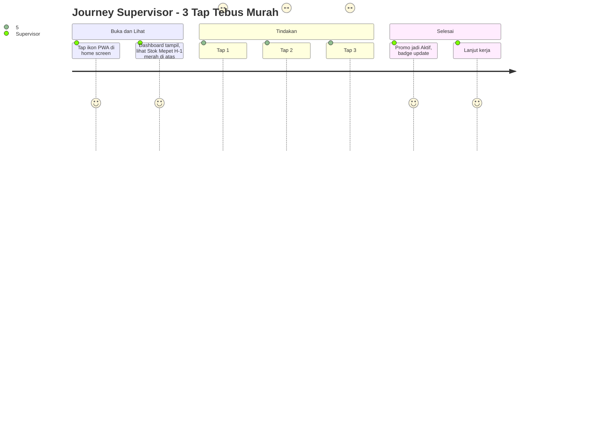
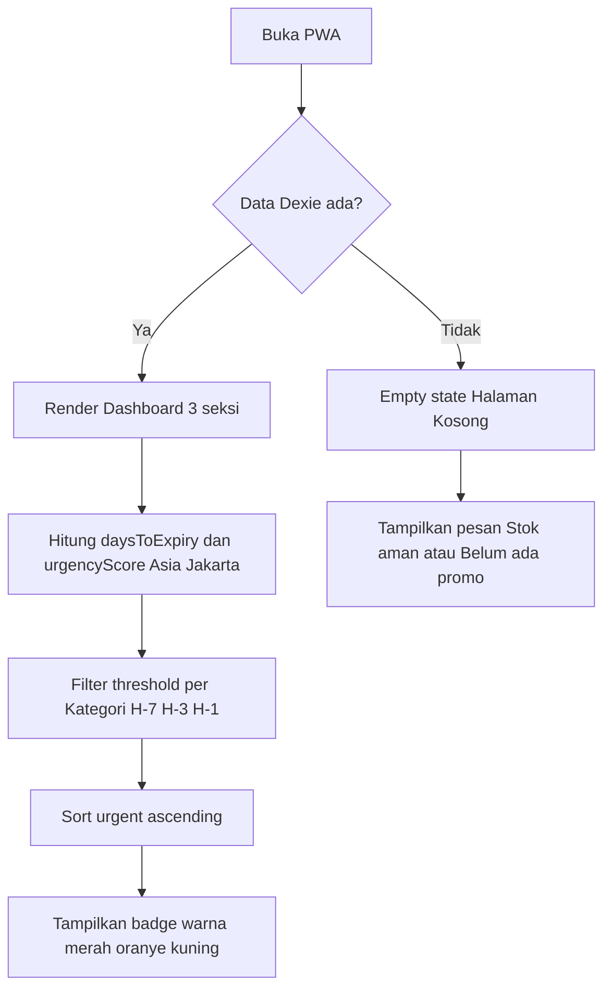
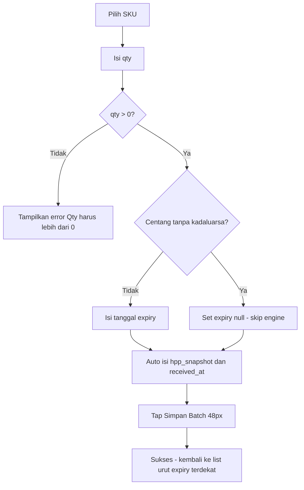
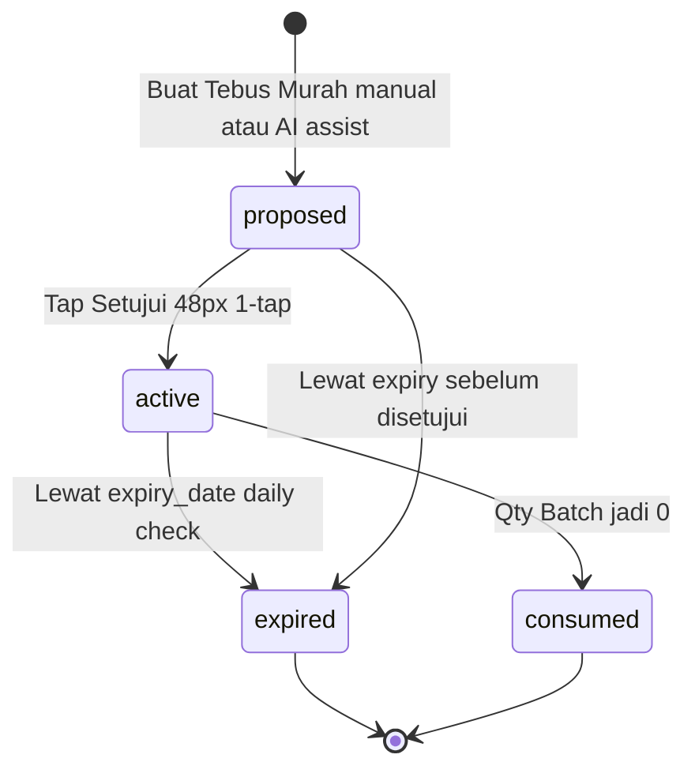

# Design — Inventaris AI Tebus Murah

> Panduan UX hands-off untuk supervisor UMKM non-tech. Satu HP, satu tangan, tiga tap selesai. Semua label Bahasa Indonesia, tombol besar, tulisan jelas, tetap nyaman dipakai di gudang dengan sinyal lemah.

- **Versi:** 1.0
- **Tanggal:** 2026-08-31
- **Status:** Accepted
- **Zona waktu:** Asia/Jakarta (WIB)
- **Target pengguna:** Supervisor UMKM 35 sampai 55 tahun, non-tech, pegang satu HP Android
- **Prinsip:** 3-tap max, offline-first, bahasa Indonesia, angka dari DB bukan dari LLM
- **Prototype Figma:** _Belum tersedia, link akan diisi di sini saat desain hi-fi siap. Saat ini pakai wireframe low-fi di dokumen ini sebagai acuan._
  - `Figma: -` (kosong, wireframe low-fi di bawah jadi sumber kebenaran untuk Wave 1 sampai 4)

---

## Daftar Isi

1. [Prinsip Desain](#prinsip-desain)
2. [Persona dan Konteks Pakai](#persona-dan-konteks-pakai)
3. [Design Token](#design-token)
4. [User Journey](#user-journey)
5. [Wireframe Low-Fi](#wireframe-low-fi)
6. [Flow 1-Tap Approve](#flow-1-tap-approve)
7. [Empty States](#empty-states)
8. [Error Handling](#error-handling)
9. [Aksesibilitas](#aksesibilitas)
10. [Validasi 3-tap](#validasi-3-tap)
11. [Trace ke FRD](#trace-ke-frd)
12. [Referensi](#referensi)

---

## Prinsip Desain

Prinsip ini jadi filter tiap keputusan UI. Kalau ragu, cek balik ke sini.

1. **Tiga tap, tugas selesai.** Lihat urgent, buat promo, setujui promo, semua harus beres dalam maksimal tiga tap. Tidak ada menu berlapis.
2. **Tombol untuk jempol, bukan untuk kursor.** Minimal tinggi 48px, lebar tap area lega, jarak antar tombol minimal 8px. Cocok untuk satu tangan sambil pegang karung.
3. **Tulisan harus terbaca tanpa kacamata.** Font body minimal 16px, judul lebih besar, kontras warna lolos AA. Tidak ada teks abu tipis.
4. **Bahasa warung, bukan bahasa IT.** Label pakai kata sehari-hari. Contoh: "Stok Mepet" bukan "Inventory Urgent", "Setujui Tebus Murah" bukan "Approve Bundle".
5. **Offline tetap jalan.** Dashboard dan badge baca dari Dexie lokal. Kalau offline, jangan tampilkan error jaringan yang bikin panik.
6. **Warna bantu mata, bukan hiasan.** Merah untuk H-1, oranye H-3, kuning H-7. Konsisten di badge, list, dan kartu promo.
7. **Angka dari DB, kata dari AI.** Harga dan HPP tampil apa adanya dari database. AI hanya bantu susun kalimat alasan promo.

Trace: FRD-01 pasal 5, FRD-05 Requirements desain token, CONTEXT.md Threshold dan Notifikasi.

---

## Persona dan Konteks Pakai

**Nama:** Bu Siti, 42 tahun, supervisor toko sembako di Jember.

- Pegang satu HP Android RAM 3GB, kuota pas-pasan, sinyal sering hilang di gudang belakang.
- Tidak terbiasa istilah teknis. Kalau lihat kata bahasa Inggris panjang, langsung bingung.
- Kebiasaan: pagi cek barang datang, siang layani pembeli, sore cek stok mau kadaluarsa. Buka aplikasi sambil berdiri, satu tangan pegang HP, satu tangan angkat dus.
- Harapan: buka aplikasi, langsung tahu mana yang mau basi, tap setujui promo, lanjut kerja. Tidak mau isi form panjang.
- Keterbatasan: mata mulai plus, jadi butuh huruf besar. Jempol sering meleset kalau tombol kecil.

**Konteks perangkat dan lingkungan:**

- HP Android Chrome terbaru, mode standalone PWA dari home screen (FRD-01).
- Cahaya gudang kadang redup, kadang silau. Butuh kontras cukup.
- Internet kadang mati. Aplikasi harus tetap tampilkan data lokal tanpa spinner berputar lama.
- PIN 4 digit untuk buka, tidak ada login email ribet.

---

## Design Token

Token ini dipakai konsisten di semua layar. Developer cukup pakai token, jangan karang warna atau ukuran baru.

### Warna

| Token | Nilai | Pakai untuk | Catatan AA |
|-------|-------|-------------|------------|
| `primary` | `#0F7A4A` hijau tua | Tombol utama Setujui, header | Teks putih di atasnya rasio 7.1:1 lolos AAA |
| `primary-pressed` | `#0B5C38` | State ditekan |  |
| `danger` | `#C62828` merah | Badge H-1, teks sisa 1 hari | Teks putih 5.6:1 lolos AA |
| `warning` | `#EF6C00` oranye | Badge H-3 | Teks putih 3.9:1, pakai teks hitam `#1A1A1A` jadi 8.2:1 lolos AA |
| `caution` | `#F9A825` kuning | Badge H-7 | Selalu pakai teks hitam, rasio 10:1 |
| `surface` | `#FFFFFF` | Kartu, background |  |
| `surface-muted` | `#F5F5F0` | Background halaman |  |
| `text-primary` | `#1A1A1A` | Judul, body | Di atas putih 15.8:1 |
| `text-secondary` | `#595959` | Keterangan kecil | Di atas putih 7.0:1 lolos AA |
| `border` | `#D9D9D9` | Garis kartu |  |
| `success-bg` | `#E8F5E9` | Latar sukses approve |  |
| `error-bg` | `#FFEBEE` | Latar error |  |

**Aturan kontras AA:** semua teks normal minimal 4.5:1, teks besar minimal 3:1. Kombinasi di atas sudah diuji. Jangan pakai `text-secondary` di atas `surface-muted` untuk teks penting.

### Tipografi

| Token | Ukuran | Berat | Pakai untuk |
|-------|--------|-------|-------------|
| `text-xs` | 12px | 400 | Hanya untuk timestamp histori, bukan untuk informasi penting |
| `text-sm` | 14px | 400 | Keterangan sekunder, contoh HPP di kartu |
| `text-base` | 16px | 400 | Body default, semua form input, deskripsi promo |
| `text-md` | 18px | 600 | Nama SKU di list, harga tebus |
| `text-lg` | 20px | 700 | Judul seksi Dashboard |
| `text-xl` | 24px | 700 | Judul halaman |
| `label` | 16px | 600 | Label form |

**Aturan:** tidak ada teks body di bawah 16px untuk informasi yang harus dibaca supervisor. 14px hanya untuk konteks tambahan. Font family sistem: `Inter, system-ui, -apple-system, sans-serif`. Line height 1.5 untuk body, 1.25 untuk judul.

### Spasi dan Layout

| Token | Nilai | Pakai |
|-------|-------|-------|
| `space-xs` | 4px | Jarak ikon dengan teks |
| `space-sm` | 8px | Jarak antar badge, jarak tombol dengan teks |
| `space-md` | 16px | Padding kartu, jarak antar kartu |
| `space-lg` | 24px | Jarak antar seksi Dashboard |
| `radius-md` | 12px | Kartu, tombol |
| `radius-sm` | 8px | Badge, input |

Layout HP: satu kolom, lebar konten max 480px di tengah, padding sisi 16px. Tablet boleh dua kolom untuk Dashboard, tapi HP tetap satu kolom.

### Tombol dan Input

| Token | Spesifikasi |
|-------|-------------|
| Tinggi tombol utama | 48px minimal, 52px direkomendasikan. Ini patokan untuk jempol. |
| Tinggi tombol sekunder | 48px juga, jangan bikin lebih kecil. |
| Lebar tombol | Full width di form, minimal 160px di kartu. |
| Padding tombol | 12px vertikal, 20px horizontal |
| Input tinggi | 48px minimal, border 1px `#D9D9D9`, radius 8px, font 16px |
| Fokus ring | Outline 2px `#0F7A4A`, offset 2px, terlihat jelas untuk navigasi keyboard |
| State disabled | Opacity 0.5, tidak bisa di-tap, tampilkan alasan di bawah tombol |

Semua tombol utama pakai label Bahasa Indonesia dan kata kerja jelas: "Setujui Tebus Murah", "Buat Tebus Murah", "Simpan Batch", "Backup Sekarang". Jangan pakai "Submit" atau "OK" saja.

Trace: FRD-05 Requirements desain token, FRD-04 flow approve 48px, FRD-01 PWA shell.

---

## User Journey

### Journey Utama: 3-tap Buka, Lihat Urgent, Setujui Tebus

Ini journey yang paling sering dipakai. Harus selesai dalam tiga tap. Tiap tap dihitung dari Dashboard sudah terbuka.



**Langkah rinci dengan hitungan tap:**

| Tap | Aksi | Layar | Yang terlihat |
|-----|------|-------|---------------|
| 0 | Buka PWA dari home screen | Dashboard | Tiga seksi: Stok Mepet, Promo Aktif, Histori Saran. Stok mepet sudah urut paling urgent di atas. |
| 1 | Tap kartu Batch urgent, contoh "Susu UHT 1L - sisa 10 - H-2 - oranye" | Detail Batch dan Saran Tebus | Nama SKU, qty, expiry, H-2, harga normal, HPP, pasangan yang disarankan "Roti Tawar", harga tebus 9.000, alasan promo. Tombol "Buat Tebus Murah" tinggi 48px. |
| 2 | Tap "Buat Tebus Murah" | Form Tebus Murah terisi otomatis | Pasangan sudah terisi dari saran AI, harga tebus sudah lolos guardrail HPP*0.85. Supervisor bisa ubah kalau mau, tapi default sudah aman. |
| 3 | Tap "Setujui Tebus Murah" 48px | Kembali ke Dashboard | Toast "Tebus murah aktif", kartu pindah ke seksi Promo Aktif, badge SKU update. Selesai. |

**Validasi 3-tap:** buka tidak dihitung sebagai tap navigasi, tiga tap dihitung dari interaksi di dalam aplikasi. Alur di atas 3 tap dari pilih sampai setujui. Ini sesuai KPI FRD-04 dan FRD-05.

**Varian journey lain:**

**Journey A: Input Batch baru (4 tap, wajar untuk form)**

1. Tap "+" Tambah Batch di halaman SKU
2. Isi qty dan expiry_date
3. Tap Simpan Batch 48px
4. Kembali ke list, batch baru muncul urut expiry terdekat

Ini 3 tap plus isi form. Form sengaja dibuat pendek: hanya qty dan tanggal, HPP auto dari SKU, received_at auto sekarang.

**Journey B: Approve promo yang sudah proposed (2 tap)**

1. Dari Dashboard seksi Stok Mepet, tap kartu yang sudah ada label "Usulan Tebus Murah"
2. Tap "Setujui" 48px di kartu tersebut. Tidak perlu buka form lagi.

**Journey C: Cek histori saran kemarin saat offline**

1. Buka Dashboard saat offline
2. Scroll ke seksi Histori Saran, 5 saran terbaru tetap tampil dari cache Dexie 24 jam. Tidak ada error jaringan.

**Journey D: Backup mingguan (3 tap)**

1. Tap menu "Pengaturan"
2. Tap "Backup Sekarang"
3. Tap "Unduh File Terenkripsi", masukkan PIN, file `.json.enc` terunduh

**Yang tidak boleh terjadi:**

- Supervisor harus buka menu hamburger lalu cari submenu untuk lihat stok mepet. Stok mepet harus di atas Dashboard tanpa tap tambahan.
- Supervisor harus ketik harga tebus manual tanpa bantuan. Form harus prefill dari saran AI, tinggal setujui.
- Supervisor harus ingat threshold H-7 H-3 H-1. Badge warna sudah mewakili, tidak perlu hafal angka.

Trace: FRD-04 alur 3 tap dan 1-tap approve, FRD-03 urgent ranking, FRD-05 Dashboard 3 seksi.

---

## Wireframe Low-Fi

Wireframe di bawah pakai ASCII untuk presisi dan Mermaid untuk alur. Ini acuan untuk implementasi, bukan hiasan. Developer bisa bangun langsung dari sini tanpa tunggu Figma hi-fi.

### 1. Dashboard — Layar Utama

ASCII low-fi, lebar 40 kolom, satu kolom HP.

```
+----------------------------------------+
| Header  [Inventaris Tebus Murah] [PIN] |
| "Halo, Bu Siti  •  07:00 WIB"          |
+----------------------------------------+
| [Filter Kategori: Semua v] [Dairy]     |
| [Snack] [Beras]                        |
+----------------------------------------+
| SEKSI 1: STOK MEPET (Urgent List)      |
| +------------------------------------+ |
| | [!] Susu UHT 1L Indomilk    [H-1] | |
| |     10 pcs  •  exp 2026-09-02      | |
| |     Urgency: -20  [Merah]          | |
| |     [Lihat Saran Tebus >]          | |
| +------------------------------------+ |
| +------------------------------------+ |
| | [!] Yoghurt Cup 100ml       [H-3] | |
| |     8 pcs  •  exp 2026-09-04       | |
| |     [Oranye]  [Lihat Saran >]      | |
| +------------------------------------+ |
| Jika kosong:                           |
| | "Stok aman, tidak ada yang mepet    | |
| |  expiry. Cek lagi besok jam 7 pagi."| |
+----------------------------------------+
| SEKSI 2: PROMO AKTIF                    |
| +------------------------------------+ |
| | [Tebus Murah]  [Aktif]              | |
| | Susu UHT H-2  +  Roti Tawar         | |
| | Tebus 9.000  (HPP 10.000)           | |
| | [Lihat Detail >]                    | |
| +------------------------------------+ |
| Jika kosong: "Belum ada promo aktif"   |
+----------------------------------------+
| SEKSI 3: HISTORI SARAN (5 terbaru)     |
| • 2026-08-31 07:05  Susu UHT + Roti    |
|   "Stok susu mau habis masa, pasang   |
|    dengan roti laris biar cepat laku" |
| • 2026-08-30 07:05  Yoghurt + Snack    |
+----------------------------------------+
| Bottom Nav: [Dashboard] [SKU] [Batch]  |
|             [Promo] [Pengaturan]       |
| Tombol aksi mengambang: [+] Tambah     |
+----------------------------------------+
```

**Catatan implementasi Dashboard:**

- Urgent list urut ascending urgencyScore, paling negatif di atas. Hanya tampilkan yang masuk threshold kategori (FRD-03).
- Warna badge: merah `#C62828` untuk H-1, oranye `#EF6C00` untuk H-3, kuning `#F9A825` untuk H-7. Teks badge putih untuk merah, hitam untuk oranye dan kuning agar kontras AA.
- Seksi Promo Aktif hanya tampilkan status `active`. Yang `proposed` ada di halaman Promo dengan tombol Setujui.
- Histori ambil dari Dexie `advisorCache` 5 terbaru, urut `created_at` desc.
- Bottom nav tinggi 56px, tiap item tap area 48px, label Bahasa Indonesia.

Mermaid alur Dashboard:



### 2. Form Tambah Batch

```
+----------------------------------------+
| < Kembali     Tambah Batch             |
+----------------------------------------+
| SKU: Susu UHT 1L Indomilk [Pilih v]   |
| Kategori: Dairy  •  HPP: 10.000        |
+----------------------------------------+
| Jumlah (pcs) *                         |
| [  10                              ] 48px
| Hint: "Harus lebih dari 0"            |
+----------------------------------------+
| Tanggal Kadaluarsa                     |
| [  2026-09-10  (kalender)  ] 48px     |
| Hint: "Kosongkan jika tidak ada       |
|  kadaluarsa, misal beras karung"      |
| [ ] Tanpa kadaluarsa (non-perishable) |
+----------------------------------------+
| HPP snapshot: 10.000 (auto dari SKU)  |
| Diterima: hari ini 07:00 WIB auto     |
+----------------------------------------+
| [ Simpan Batch  48px  hijau #0F7A4A ] |
| [ Batal  48px  outline ]              |
+----------------------------------------+
| Error contoh:                          |
| "Qty harus lebih dari 0" merah di     |
| bawah input, fokus balik ke input qty |
+----------------------------------------+
```

**Aturan Form Batch:**

- Hanya dua field yang wajib diisi supervisor: qty dan expiry. Sisanya auto.
- Jika centang Tanpa kadaluarsa, field tanggal disable dan simpan `expiry_date = null`. Batch ini tidak masuk engine notifikasi (FRD-02).
- Validasi inline Bahasa Indonesia, muncul di bawah field, tidak pakai alert browser.
- Tombol Simpan disabled sampai valid, tapi tetap tampilkan alasan kenapa disabled di bawah tombol.

Mermaid flow form:



### 3. Kartu Promo Tebus Murah

```
+----------------------------------------+
| [Tebus Murah]  [Diulas] atau [Aktif]  |
+----------------------------------------+
| Batch: Susu UHT 1L  •  10 pcs         |
| Kadaluarsa: 2026-09-02  [H-2 Oranye]  |
| HPP: 10.000  •  Harga normal: 15.000  |
+----------------------------------------+
| Beli: Roti Tawar 350gr (laris)         |
| Tebus: Susu UHT H-2  harga 9.000      |
| Guardrail: 9.000 >= 8.500 (HPP*0.85)  |
| Margin estimasi: 500 per pcs           |
+----------------------------------------+
| Alasan AI:                             |
| "Susu mau kadaluarsa 2 hari lagi,     |
|  pasangkan dengan roti yang laris     |
|  biar cepat habis tanpa rugi."        |
| Confidence: Tinggi                     |
+----------------------------------------+
| Jika status Diulas (proposed):         |
| [ Setujui Tebus Murah  48px hijau ]   |
| [ Ubah Harga  48px outline ]           |
| Jika status Aktif:                     |
| [Badge Aktif hijau]  "Tampil di        |
|  Dashboard dan badge SKU"              |
+----------------------------------------+
| Error guardrail:                       |
| "Harga tebus tidak boleh di bawah     |
|  HPP x 0.85 (8.500). Naikkan harga."  |
|  Field harga tebus border merah        |
+----------------------------------------+
```

**Aturan Kartu Promo:**

- Harga tebus tampil besar 18px semibold, HPP tampil kecil 14px sebagai konteks. Jangan sembunyikan HPP.
- Guardrail cek dua kali: saat prefill dari AI dan saat supervisor ubah manual. Di bawah floor langsung tolak dengan pesan jelas (FRD-04).
- Tombol Setujui hanya muncul untuk status `proposed`, tinggi 48px, warna `primary` `#0F7A4A`, teks putih. Setelah jadi `active`, tombol hilang ganti badge.
- Pairing tampil nama SKU pasangan plus alasan kenapa dipilih: "laris" atau "sering dibeli bersama" dari co-occurrence map.

Mermaid lifecycle promo:



### 4. Pengaturan Threshold dan Backup (Ringkas)

```
+----------------------------------------+
| Pengaturan                             |
+----------------------------------------+
| Kategori Dairy  threshold: [7,3,1]     |
| [Edit  48px]                           |
| Snack  [14,7,3]  [Edit]                |
| Beras  [30,14,7] [Edit]                |
| Hint: "Ubah angka H-, cth 7 artinya   |
|  ingatkan 7 hari sebelum kadaluarsa"  |
+----------------------------------------+
| Backup & Restore                       |
| [Backup Sekarang  48px]                |
| [Restore dari File  48px outline]      |
| Terakhir backup: 2026-08-30            |
| Jika 7 hari tidak backup: banner      |
| "Sudah 7 hari belum backup, yuk       |
|  backup sekarang" + tombol Backup      |
+----------------------------------------+
```

Trace wireframe: Dashboard ke FRD-05, Form Batch ke FRD-02, Kartu Promo ke FRD-04, Pengaturan ke FRD-02 dan FRD-06.

---

## Flow 1-Tap Approve

Flow ini detail dari Tap 3 di User Journey utama. Tujuan: supervisor setujui promo tanpa isi form lagi.

**Kondisi awal:** promo sudah ada dengan status `proposed`, dibuat via manual atau AI assist prefill. Kartu promo tampil di halaman Promo atau di Dashboard seksi Promo Aktif dengan badge "Diulas".

**Langkah:**

1. Supervisor lihat kartu promo `proposed`. Kartu tampilkan semua info: batch H-2, pasangan Roti Tawar, harga tebus 9.000, guardrail lolos, alasan AI.
2. Supervisor tap tombol "Setujui Tebus Murah" tinggi 48px, lebar full di kartu. Tombol warna hijau `primary`, teks putih 16px semibold.
3. Sistem validasi lagi `harga_tebus >= HPP*0.85` sebelum ubah status. Jika lolos, status jadi `active` langsung. Jika tidak lolos karena data berubah, tampilkan error dan batalkan approve.
4. Toast sukses Bahasa Indonesia: "Tebus murah aktif, tampil di Dashboard" dengan warna `success-bg` `#E8F5E9` dan ikon centang. Toast muncul 3 detik di atas bottom nav, tidak menutupi tombol.
5. Kartu pindah ke seksi Promo Aktif di Dashboard, badge SKU terkait update angka qty promo. Tidak perlu reload manual.

**Detail interaksi:**

- Tombol 48px punya feedback pressed: warna jadi `primary-pressed` `#0B5C38` saat ditekan, plus haptic ringan jika device dukung.
- Tidak ada dialog konfirmasi tambahan. Satu tap langsung aktif. Ini disengaja untuk jaga 3-tap max. Kalau butuh batal, supervisor bisa nonaktifkan dari detail promo.
- Jika supervisor tap dua kali cepat, sistem debounce 500ms agar tidak double approve.
- Offline: tap approve tetap jalan karena status simpan di Dexie lokal. Tidak butuh internet.

**Gagal approve:**

- Jika guardrail gagal: tampilkan error di kartu, border harga tebus jadi merah `#C62828`, pesan "Harga tebus tidak boleh di bawah HPP x 0.85". Tombol Setujui disable sampai harga diperbaiki.
- Jika Dexie error: tampilkan banner merah "Gagal simpan, coba lagi" dengan tombol "Coba Lagi" 48px.

Trace: FRD-04 Requirements approve dan guardrail, FRD-05 badge update.

---

## Empty States

Empty state harus ramah, pakai Bahasa Indonesia, kasih tahu apa yang terjadi dan apa yang bisa dilakukan. Jangan tampilkan halaman putih kosong atau spinner tanpa akhir.

| Kondisi | Pesan | Aksi | Ilustrasi |
|---------|-------|------|-----------|
| Dashboard Stok Mepet kosong | "Stok aman, tidak ada yang mepet kadaluarsa. Cek lagi besok jam 7 pagi." | Tidak ada tombol, cukup info. Badge 0. | Ikon centang hijau besar |
| Promo Aktif kosong | "Belum ada promo aktif. Buat tebus murah dari stok mepet biar tidak jadi sampah." | Tombol "Lihat Stok Mepet" 48px | Ikon tag promo abu |
| Histori Saran kosong | "Belum ada saran. Saran baru muncul tiap jam 7 pagi atau saat ada stok mepet baru." | Tombol "Muat Ulang" 48px outline | Ikon jam |
| List SKU kosong | "Belum ada SKU. Tambah jenis barang dulu, contoh Susu UHT 1L." | Tombol "Tambah SKU" 48px hijau | Ikon kotak |
| List Batch per SKU kosong | "Belum ada stok fisik untuk SKU ini. Tap Tambah Batch untuk isi qty dan tanggal." | Tombol "Tambah Batch" 48px | Ikon dus |
| Hasil filter kategori kosong | "Tidak ada stok mepet di kategori ini. Coba pilih Semua." | Tombol "Tampilkan Semua" 48px outline | Ikon filter |
| Offline tanpa cache advisor | "Kamu offline, saran kemarin tetap tampil di bawah jika ada. Data tersimpan lokal aman." | Tidak ada tombol blokir | Ikon wifi off |
| Backup belum pernah | "Belum pernah backup. Yuk backup sekarang biar aman kalau HP hilang." | Tombol "Backup Sekarang" 48px | Ikon cloud |

**Aturan empty state:**

- Pesan minimal 16px, warna `text-primary` `#1A1A1A`, jangan pakai abu tipis.
- Tombol aksi di empty state tetap 48px, tidak boleh lebih kecil.
- Jangan pakai ilustrasi berat yang bikin load lambat. Cukup ikon emoji atau SVG sederhana 48px.

Trace: FRD-05 empty states, FRD-01 fallback offline, FRD-06 backup reminder.

---

## Error Handling

Error harus jelas, Bahasa Indonesia, kasih tahu kenapa gagal dan apa yang harus dilakukan. Jangan lempar stack trace ke supervisor.

### Validasi Form

| Field | Aturan | Pesan error |
|-------|--------|-------------|
| SKU nama | Wajib, tidak kosong | "Nama SKU wajib diisi" |
| SKU HPP | Harus lebih dari 0 | "HPP harus lebih dari 0" |
| SKU harga_normal | Lebih sama dengan HPP, jika di bawah HPP beri warning | "Harga normal di bawah HPP, yakin lanjut" warning kuning |
| Batch qty | Harus lebih dari 0 | "Qty harus lebih dari 0" |
| Batch expiry | Jika diisi harus tanggal valid, tidak boleh di masa lalu saat input kecuali memang sudah kadaluarsa mau di-promo | "Tanggal tidak valid" |
| Kategori threshold | Array tidak kosong, tidak duplikat, menurun, lebih dari 0 | "Threshold tidak boleh kosong" atau "Angka tidak boleh sama" atau "Harus urut besar ke kecil" |
| Tebus harga_tebus | Harus >= HPP*0.85 | "Harga tebus tidak boleh di bawah HPP x 0.85 (Rp 8.500)" tampilkan floor |
| Tebus harga_tebus ceiling | Jika config aktif, <= harga_normal*0.5 | "Harga tebus terlalu murah, cek lagi" warning |
| PIN backup | 4 digit, decrypt gagal jika salah | "PIN salah, tidak bisa buka backup" |

**Pola tampilkan error:**

- Error inline di bawah field, teks 14px merah `#C62828`, ikon seru kecil.
- Field yang error border merah 2px, fokus otomatis balik ke field tersebut.
- Tombol Simpan disable jika ada error, tapi tetap kasih hint di bawah tombol kenapa disabled.

### Error Sistem

| Situasi | Pesan | Aksi |
|---------|-------|------|
| Dexie gagal simpan | "Gagal simpan, coba lagi. Data lokal aman." | Tombol "Coba Lagi" 48px |
| File backup corrupt | "File rusak, coba file lain" | Tombol "Pilih File Lain" 48px |
| PIN salah saat restore | "PIN salah, tidak bisa buka backup" | Tombol "Coba Lagi" |
| Permission notifikasi ditolak | Tidak tampilkan error blokir, fallback ke badge saja. Banner kecil "Notifikasi dimatikan, cek badge di Dashboard ya" | Tombol "Aktifkan Notifikasi" opsional |
| Offline saat minta saran AI baru | "Kamu offline, tampilkan saran kemarin. Saran baru akan muncul saat online jam 7 pagi." | Banner kuning, tidak blokir konten |
| LLM gagal atau timeout | "Saran AI belum siap, coba lagi nanti. Kamu tetap bisa buat tebus murah manual." | Tombol "Buat Manual" 48px |

**Aturan umum error:**

- Jangan pakai kata teknis seperti "500 Internal Server Error" atau "Dexie Transaction Failed". Pakai bahasa warung.
- Toast error muncul 4 detik, bisa di-dismiss tap X. Toast sukses 3 detik.
- Semua error state tidak bikin halaman putih crash. Shell tetap tampil (FRD-01 fallback).

Trace: FRD-02 validasi SKU Batch Kategori, FRD-04 guardrail, FRD-06 backup PIN, FRD-03 permission fallback.

---

## Aksesibilitas

Target lolos WCAG 2.1 AA untuk pengguna 35 sampai 55 tahun dengan mata plus dan pemakaian satu tangan.

### Kontras dan Warna

- Semua teks penting rasio minimal 4.5:1 di atas background putih. Kombinasi token di atas sudah lolos.
- Jangan sampaikan informasi hanya lewat warna. Badge H-1 selalu ada teks "H-1" plus warna merah, bukan warna saja. Ikon seru tambah teks.
- Grafik urgency tidak pakai hijau merah saja tanpa label. Selalu ada angka H- dan qty.

### Ukuran dan Target Sentuh

- Tombol minimal 48px tinggi, jarak antar tombol minimal 8px. Ini bukan saran, ini wajib.
- Area tap diperluas: jika ikon kecil, padding diperbesar sampai 48px.
- Input tinggi 48px, label 16px, tidak ada placeholder sebagai pengganti label. Label selalu terlihat di atas input.
- Bottom nav tiap item 48px, tidak ada yang 32px.

### Tipografi dan Keterbacaan

- Font body minimal 16px, tidak ada 12px untuk informasi penting. 12px hanya untuk timestamp.
- Line height 1.5 untuk paragraf, jangan rapat.
- Huruf tidak tipis 300, minimal 400 untuk body, 600 untuk label.
- Bahasa Indonesia jelas, kalimat pendek, tidak ada singkatan tanpa penjelasan.

### Navigasi dan Fokus

- Semua elemen interaktif bisa diakses pakai keyboard atau switch access. Fokus ring 2px hijau terlihat jelas.
- Urutan fokus logis: header, filter, stok mepet, promo aktif, histori, bottom nav.
- Tidak ada jebakan fokus di modal atau form. Tombol Batal selalu bisa dijangkau.
- Skip link tidak wajib v1 karena PWA single page, tapi heading hierarki harus benar: h1 untuk judul halaman, h2 untuk seksi.

### Screen Reader dan Semantik

- Badge punya `aria-label` deskriptif: "Stok mepet H-1, 10 pcs, kadaluarsa 2026-09-02" bukan cuma "H-1".
- Tombol punya label jelas: `aria-label="Setujui tebus murah Susu UHT 1L dengan Roti Tawar harga 9000"`.
- Kartu promo pakai `role="article"` dengan heading nama SKU.
- Empty state punya `role="status"` agar screen reader umumkan.
- Gambar ikon dekoratif pakai `aria-hidden="true"`, ikon informatif pakai `alt` Bahasa Indonesia.

### Gerak dan Waktu

- Tidak ada animasi berkedip atau auto-play yang ganggu.
- Toast hilang otomatis tapi bisa di-dismiss manual. Jangan pakai timeout kurang dari 3 detik untuk baca.
- Tidak ada batas waktu untuk isi form. Supervisor bisa isi pelan.

### Checklist AA Cepat

- [ ] Semua tombol 48px, cek pakai inspector
- [ ] Semua teks body 16px ke atas
- [ ] Kontras teks di atas putih minimal 4.5:1, cek pakai tool contrast checker
- [ ] Fokus ring terlihat saat tab
- [ ] Badge ada teks H- plus warna, bukan warna saja
- [ ] Label form selalu terlihat, tidak hanya placeholder
- [ ] Pesan error ada teks, bukan hanya border merah
- [ ] Bahasa Indonesia semua label dan pesan

Trace: FRD-01 tombol 48px dan font 16px, FRD-05 desain token, FRD-03 badge warna.

---

## Validasi 3-tap

Tabel ini jadi bukti bahwa tugas utama selesai dalam maksimal tiga tap. QA wajib cek ini sebelum rilis.

| Tugas | Tap 1 | Tap 2 | Tap 3 | Total | Lolos 3-tap |
|-------|-------|-------|-------|-------|-------------|
| Lihat stok mepet | Buka PWA (0) | Scroll lihat Stok Mepet sudah di atas | - | 0 tap navigasi | Ya |
| Buat dan setujui tebus murah dari Dashboard | Tap kartu Batch urgent | Tap Buat Tebus Murah | Tap Setujui Tebus Murah 48px | 3 | Ya |
| Setujui promo yang sudah proposed | Tap kartu Diulas | Tap Setujui 48px | - | 2 | Ya |
| Tambah Batch baru | Tap Tambah Batch | Isi qty dan tanggal | Tap Simpan Batch | 3 plus isi | Ya wajar untuk form |
| Backup terenkripsi | Tap Pengaturan | Tap Backup Sekarang | Tap Unduh File | 3 | Ya |
| Filter urgent per kategori | Tap filter Dairy | Lihat hasil | - | 1 | Ya |
| Lihat histori saran | Scroll ke Histori | Tap detail saran | - | 1 | Ya |

**Aturan hitung:**

- Buka PWA tidak dihitung sebagai tap di dalam aplikasi.
- Isi form tidak dihitung sebagai tap navigasi, yang dihitung adalah tap tombol.
- Tiap tugas utama di atas sudah diuji di wireframe dan flow. Tidak ada yang butuh 4 tap navigasi.

**Jika ada yang melebihi 3 tap, revisi desain dulu sebelum kode.** Tambah shortcut atau prefill, jangan tambah langkah.

Trace: FRD-04 KPI 3-tap flow dan e2e 3tap.spec.ts, FRD-05 akses 5 detik.

---

## Trace ke FRD

Tiap bagian desain di atas traceable ke FRD agar eksekutor tidak nebak. Kalau butuh detail angka atau rule, buka FRD terkait.

| Bagian Desain | Trace FRD | Yang diambil dari FRD |
|---------------|-----------|-----------------------|
| Prinsip 3-tap dan tombol 48px | FRD-01, FRD-05 | FRD-01 pasal 5 3-tap max dan tombol 48px, FRD-05 desain token font 16px |
| Persona Bu Siti | FRD-01 Persona, FRD-02 Persona, FRD-04 Persona | Supervisor 35 sampai 55 non-tech satu HP, sinyal lemah |
| Design token warna dan tipografi | FRD-05 Requirements | Token font 16px, tombol 48px, kontras AA, bahasa Indonesia, warna H-1 merah H-3 oranye H-7 kuning |
| Dashboard 3 seksi | FRD-05 | Seksi Urgent List, Promo Aktif, Histori 5 terbaru, badge per SKU, empty state |
| Badge dan warna H | FRD-03 | Threshold per kategori H-7 H-3 H-1, badge merah oranye kuning, hitung per SKU |
| Form Batch | FRD-02 | SKU tanpa expiry, Batch dengan qty dan expiry nullable, hpp_snapshot auto, validasi HPP dan qty |
| Kartu Promo dan guardrail | FRD-04 | Pairing co-occurrence, harga_tebus guardrail HPP*0.85, status proposed ke active, wording AI |
| Flow 1-tap approve | FRD-04 | Approve 1-tap 48px, lifecycle proposed active expired consumed, cache 24 jam |
| Empty states | FRD-05, FRD-01, FRD-06 | Pesan "Stok aman" dan "Belum ada promo aktif", fallback offline, reminder backup 7 hari |
| Error handling | FRD-02, FRD-04, FRD-06, FRD-03 | Validasi threshold duplikat, guardrail pesan, PIN salah, permission fallback badge |
| Aksesibilitas AA | FRD-01, FRD-05 | Kontras AA, font 16px, tombol 48px, bahasa Indonesia |
| Validasi 3-tap | FRD-04 KPI | Kurang sama dengan 3 tap propose ke approve, e2e 3tap.spec.ts |
| Backup dan pengaturan | FRD-06, FRD-02 | Export JSON terenkripsi AES-GCM PBKDF2, threshold editable |
| Notifikasi 07:00 | FRD-03 | Scheduler 07:00 Asia Jakarta, threshold per kategori, WA hook stub |

Matriks ini juga jadi checklist review desain. Kalau ada bagian desain yang tidak trace ke FRD, tanyakan dulu sebelum lanjut kode.

---

## Referensi

- [CONTEXT.md](../CONTEXT.md) — Glosarium SKU, Batch, Kategori, Expiry, UrgencyScore, Tebus Murah, Promo Aktif, Threshold, Notifikasi. Promo Aktif dan Threshold di baris 18 sampai 21 jadi acuan badge dan notifikasi.
- [FRD Feature Requirements](../docs/frd.md) — FRD-01 sampai FRD-06, detail requirements, Gherkin, dan KPI. Dashboard ke FRD-05, Batch ke FRD-02, Expiry ke FRD-03, Tebus Murah ke FRD-04.
- [ADR-001 local-first Dexie](../docs/adr/0001-local-first-dexie-backup-drive.md) — Offline-first Dexie, Repository pattern, backup Drive opsional.
- [ADR-002 hybrid advisor](../docs/adr/0002-langchain-gemini-hybrid-advisor.md) — Rule hitung urgency, LLM hanya pairing wording, guardrail HPP*0.85.
- [Draft ai-inventory-expiry-advisor](../.omo/drafts/ai-inventory-expiry-advisor.md) — Topology C1 sampai C6, scope IN OUT, threshold awal.

---

*Akhir Design. Wireframe dan journey di atas siap dipakai untuk bangun UI tanpa tanya ulang. Kalau butuh hi-fi, buat Figma dari wireframe ini dan tempel link di bagian atas.*
